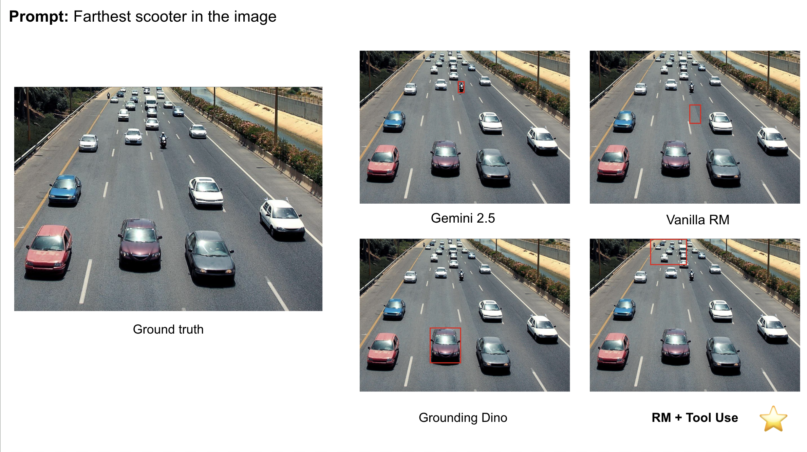
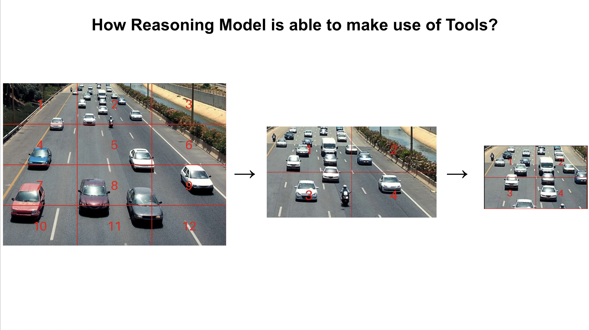

# Vision Evals

A powerful Python package for object detection using advanced vision and reasoning models, including OpenAI's models and Google's Gemini.


*Comparison of detection results across different models - showing the superior performance of the advanced reasoning model*

## Features

- **Multiple Detection Models**: 
  - Advanced Reasoning Model (OpenAI) - Reasoning model that leverages tools and other foundation models to perform object detection
  - Vanilla Reasoning Model - Directly using a reasoning model to perform object detection
  - Vision Model - GroundingDino + SAM
  - Gemini Model (Google) - Fine-tuned LMM for object detection

- **Tool-Use Reasoning**: Our advanced model uses innovative grid-based reasoning for precise object detection
  
  
  *How the advanced reasoning model works under the hood - using grid cells for precise localization*

- **Handles Complex Scenarios**: Excels at out-of-distribution and challenging detection tasks
  
  
  *Detecting objects in challenging conditions where traditional models fail*
  
  
  *Another demonstration of handling complex, ambiguous queries with precision*

- **Simple API**: One function for all your detection needs
- **CLI Support**: Command-line interface for quick testing

## Installation

```bash
pip install vision-evals
```

Or install from source:
```bash
git clone https://github.com/yourusername/vision-evals.git
cd vision_evals
pip install -e .
```

## Setup

Create a `.env` file in your project root:

```bash
# .env
OPENAI_API_KEY=your-openai-api-key-here
GEMINI_API_KEY=your-google-gemini-api-key-here
```

Get your API keys:
- OpenAI: https://platform.openai.com/api-keys
- Gemini: https://makersuite.google.com/app/apikey

## Quick Start

### Python API

```python
from vision_evals import detect

# Detect objects in an image
result = detect(
    image_path="https://ix-cdn.b2e5.com/images/27094/27094_3063d356a3a54cc3859537fd23c5ba9d_1539205710.jpeg",  # or image-path
    object_of_interest="farthest scooter in the image",
    task_type="advanced_reasoning_model"
)

# Access results
bboxes = result['bboxs']
visualized_image = result['visualized_image']
print(f"Found {len(bboxes)} objects")

# Save the result
visualized_image.save("output.jpg")
```

### Command Line

```bash
# Basic usage
vision-evals --image-path "image.jpg" --object-of-interest "person"  # "advanced_reasoning_model" used by default

# With specific model
vision-evals --image-path "image.jpg" --object-of-interest "cat" --task-type "gemini"

# From URL with custom parameters
vision-evals \
  --image-path "https://example.com/image.jpg" \
  --object-of-interest "text in image" \
  --task-type "advanced_reasoning_model" \
  --task-kwargs '{"nms_threshold": 0.7}'
```

### Available Models

- `advanced_reasoning_model` (default) - Best accuracy, uses tool-use reasoning
- `vanilla_reasoning_model` - Faster, standard detection
- `vision_model` - Uses GroundingDino + (optional) SAM2 for segmentation
- `gemini` - Google's Gemini model

## License

MIT License